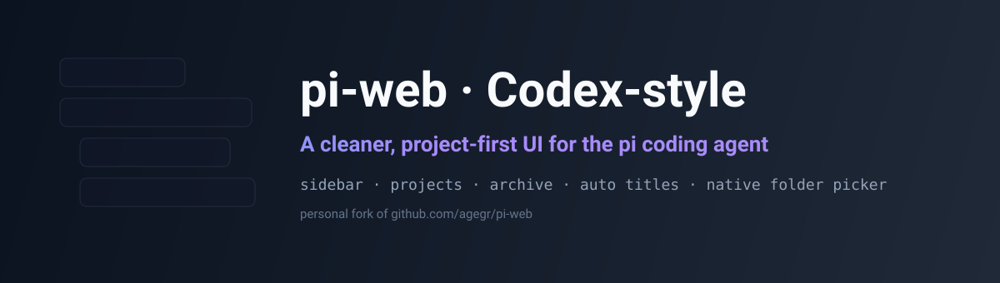

<div align="center">
  
  <h1>pi-web · 类 Codex 个人改进版</h1>
  <p><b>为 <a href="https://github.com/earendil-works/pi">pi coding agent</a> 打造的更清爽、以项目为中心的界面。</b><br/>
  选一个文件夹 → 创建项目 → 直接开聊，不再被拥挤的侧边栏淹没。</p>

  <p>
    
    = 22.19.0" />
    
    <a href="https://github.com/huangzx8090/pi-web/stargazers"></a>
  </p>
  <p><a href="./README.md">English</a> · <a href="./README.zh-CN.md">简体中文</a></p>
</div>

> ⚠️ **这是个人 fork / 改进版，不是官方项目。** 官方仓库是
> [agegr/pi-web](https://github.com/agegr/pi-web)，本版本不发布到 npm。

本版本与 pi **共用同一份本地配置和会话文件**（`~/.pi/agent`），所以你的历史对话、模型、技能都不会丢，只是界面围绕「项目」重新设计了一遍。

---

## 为什么要做这个 fork？

上游的侧边栏把所有对话平铺在一个密集的树里。项目一多、对话一多，就非常拥挤。这个 fork 参考 **Codex** 重做了侧边栏：

- 对话变成**单行**，操作按钮只在 hover 时出现；
- 一切**按项目分组**，每个项目默认只显示**最近 5 个**对话；
- 有了真正的**创建项目**流程，以及**归档**的去处。

如果你喜欢 pi，但觉得界面太挤，这个版本适合你。

## ✨ 主要改进

| | |
| --- | --- |
| 🧹 **类 Codex 侧边栏** | 对话单行、hover 才出操作、按项目分组、默认最近 5 个（可「展开其余 N 个」）。 |
| 📁 **创建项目** | 填项目名 + 选文件夹，创建后直接开聊；没对话的项目也保留，显示「暂无聊天」。 |
| 🗑️ **删除项目** | 连同该项目**所有对话历史**一起删除（磁盘上的源码文件夹不受影响）。 |
| 🗄️ **归档** | 可**按项目归档**（对话一起归档），也可**单独归档某个对话**；软隐藏，随时恢复，统一在弹窗里管理。 |
| ✨ **标题自动生成** | 新建对话根据**第一条消息**自动命名，无需点按钮；已命名/手动改名的对话不会被覆盖。 |
| 🔎 **原生文件夹选择** | macOS 下创建项目直接弹 **Finder**；其它平台自动回退到应用内目录浏览。 |
| 📌 **置顶** | 项目与对话都可置顶，支持拖动排序。 |
| 🌏 **多语言** | English、简体中文、繁體中文。 |

## 📸 截图

> 把截图放到 `docs/sidebar.png` 和 `docs/create-project.png`，然后取消下面注释即可。

<!--
<p align="center">
  
</p>
<p align="center">
  
</p>
-->

## 🚀 快速开始

需要 **Node.js 22.19.0+**。

```bash
git clone https://github.com/huangzx8090/pi-web.git
cd pi-web
npm install
npm run dev
```

打开 <http://127.0.0.1:30141>。如果还没配置模型，请打开 **Models** 面板登录或填写 API Key。

生产模式：

```bash
npm run build
node bin/pi-web.js
# 或全局安装
npm install -g .
pi-web
```

## 与上游的差异

| 方面 | 上游 | 本版本 |
| --- | --- | --- |
| 侧边栏行 | 两行 + 常驻操作按钮 | 单行 + hover 操作 |
| 分组 | 平铺 / 最近项目 | 项目分组 + 缩进 + 折叠 |
| 项目生命周期 | 隐式（由 cwd 推导） | 创建 / 删除 / 归档 |
| 会话标题 | 手动点按钮 | 首条消息后自动生成 |
| 选择文件夹 | 应用内浏览 | macOS 原生 Finder（含回退） |
| 费用显示 | 美元 | 人民币 |

其余能力（对话、分支、文件浏览、Git worktree、模型与技能配置）均继承上游。

## 数据位置

本版本新增数据与 pi 的会话文件放在一起：

| 文件 | 内容 |
| --- | --- |
| `~/.pi/agent/pi-web/projects.json` | 手动创建的项目 |
| `~/.pi/agent/pi-web/archive.json` | 已归档的项目 / 对话 |
| `~/.pi/agent/pi-web/pins.json` | 置顶的项目 / 对话 |

删除或归档只影响**对话历史文件**，不会删除你的项目源码目录。

## 同步上游

```bash
git fetch origin
git rebase origin/main
git push --force-with-lease fork main
```

## 致谢与许可

基于 [agegr/pi-web](https://github.com/agegr/pi-web) 与
[earendil-works/pi](https://github.com/earendil-works/pi)。

[MIT](./LICENSE)

<div align="center"><sub>如果它对你有帮助，点个 ⭐ 能让更多人看到。</sub></div>
